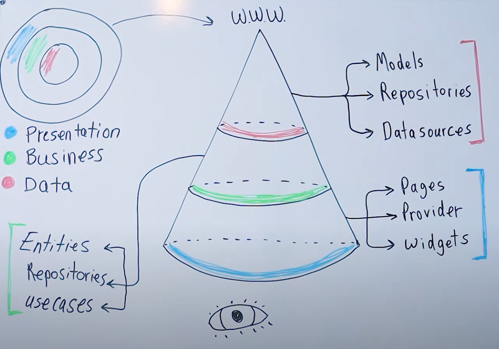
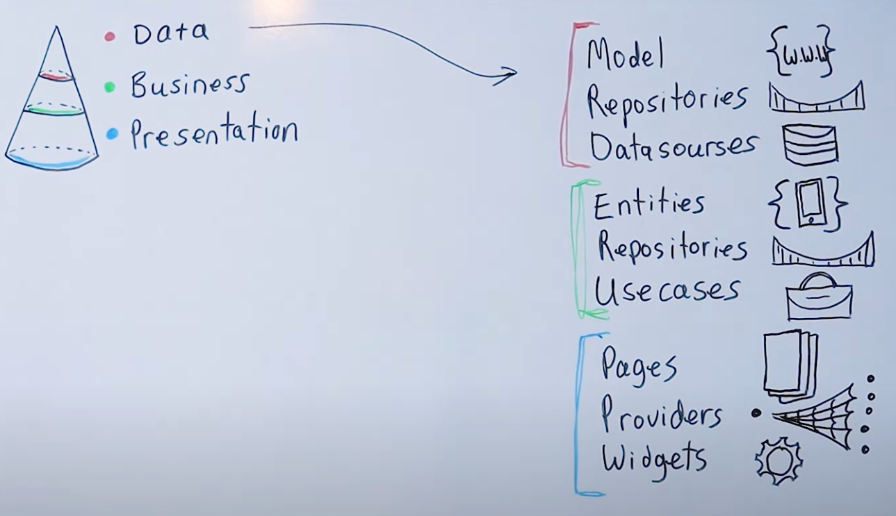
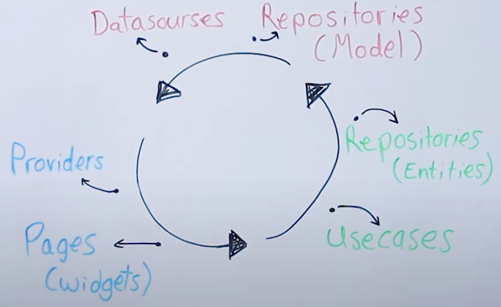
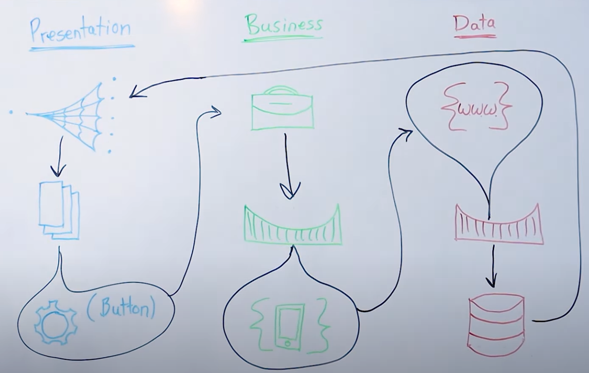
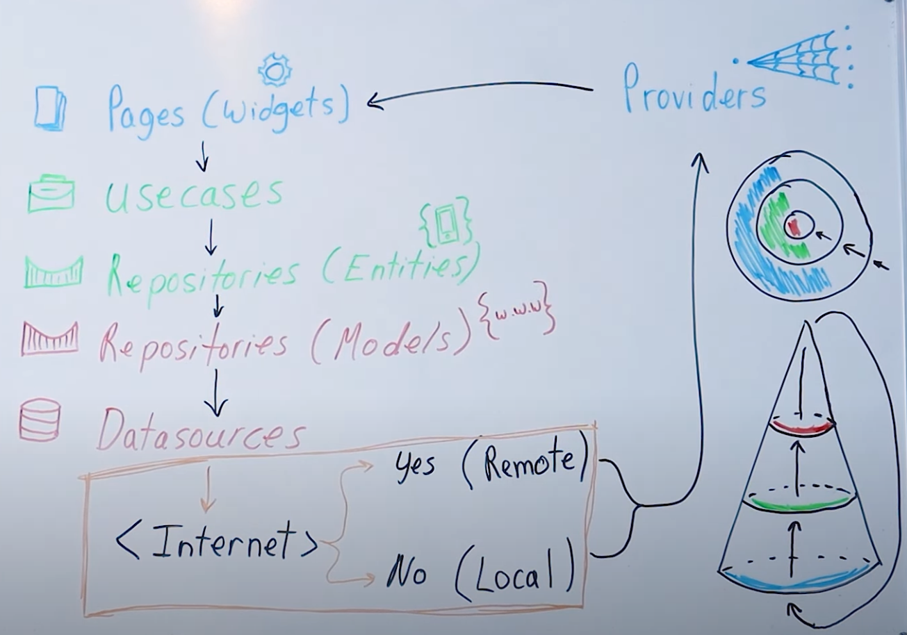

# Flutter Clean Architecture

En esta imagen vemos las capas de una arquitectura limpia como un cono, siendo la parte de abajo la capa de presentación (lo que ve el usuario) y la de arriba la parte de la data.

En cada capa vemos las carpetas que se utilizan. Así:

- Capa Presentación: usa las carpetas widgets, provider y pages
- Capa Negocio: usa las carpetas usecases, repositories y entities
- Capa Datos: usa las carpetas repositories, models y datasources

## Asociar imágenes con las carpetas

Hacemos esto con la idea de recordar qué carpetas corresponden a cada capa.

En esta imagen vemos como asociar imágenes a las carpetas, con la idea de saber qué significa cada carpeta.

- Model y Entities son parecidos. Model tiene `w.w.w` porque es algo que viene de fuera (Internet), y Entities tiene un móvil porques es lo que está en el móvil
- Repositories son representados por un puente, ya que son un puente entre la data y la capa de negocio
- Datasources es representado por una BD
- Usecases es representado como un maletín de trabajo
- Pages es representado por unas páginas
- Provider es representado por una red, ya que es como gestionamos toda la data
- Widget es representado por un símbolo

## Como se vincula todo

En esta imagen vemos como se vincula todo en un círculo sin fin.

Empezamos con los `Pages`, dentro de las cuales tenemos los `Widgets`.

Si, por ejemplo, pulsamos click en un botón, en la capa de negocio se dispara un `Usecase`, que usará un `Repository` dentro de la capa de negocio con las `Entities` y crearán un puente entre el negocio y la capa de datos.

En la capa de datos tenemos otro `Repository`, que en este caso usa los `Models`, y que usará los `Datasources`. Estos obtendrán toda la data y la depositarán en los `Providers` que la gestionan, y estos actualizarán la pantalla, que a su vez actualizarán los `Pages` y los `Widgets`.

## Otra forma de ver Clean Architecture

En esta imagen vemos como hemos reutilizado los símbolos de nuestra segunda imagen. Veremos de nuevo como trabaja todo unido.

De nuevo empezamos en la capa de presentación con los `Pages` que usan los `Widgets`, por ejemplo un botón. Pulsamos click en el botón.

En la capa de negocio se dispara el `Usecase` que obtendrá toda la data necesaria. Para obtener esta data, el caso de uso necesita pasar por el puente, es decir, el `Repository`, que usará nuestros `Entities`.

Nuestro puente, es decir, el `Repository`, usará los `Models` de la capa de datos.

Una vez que hemos usamos los puentes para pasar de la capa de negocio y la capa de datos, podemos usar el `Repository` dentro de la capa de datos para obtener la data de los `Datasources`. Esta data vuelve al `Provider`, que cambiará la parte visual, es decir, los `Pages` de nuestra aplicación.

## Una última forma de ver Clean Architecture

Vemos esta última forma de visualizar Clean Architecture para estar seguros de haber comprendido su funcionamiento.

En esta imagen vemos nuestras `Pages`, que contiene nuestros `Widgets`, entre ellos un botón.

Cuando el usuario pulsa click en el botón, se dispara el `Usecase` cuyo objetivo, por ejemplo, es obtener data de algo.

Este algo pasará al `Repository` de la capa de negocio, y luego pasará al `Repository` de la capa de datos.

El `Repository` de la capa de datos usará el `Datasource`.

Aquí introducimos un nuevo concepto. El `Datasource` pasará a una lógica. Si tenemos conexión a Internet pasamos a un `Datasource remoto` porque obtendremos la data de un API online. Si no tenemos conexión a Internet obtendremos la data de nuestra `BD local del móvil`.

Una vez tenemos la data, la llevamos al `Provider`, donde se cambiará la data y este refrescará los `Pages` y los `Widgets` de nuestra app.
